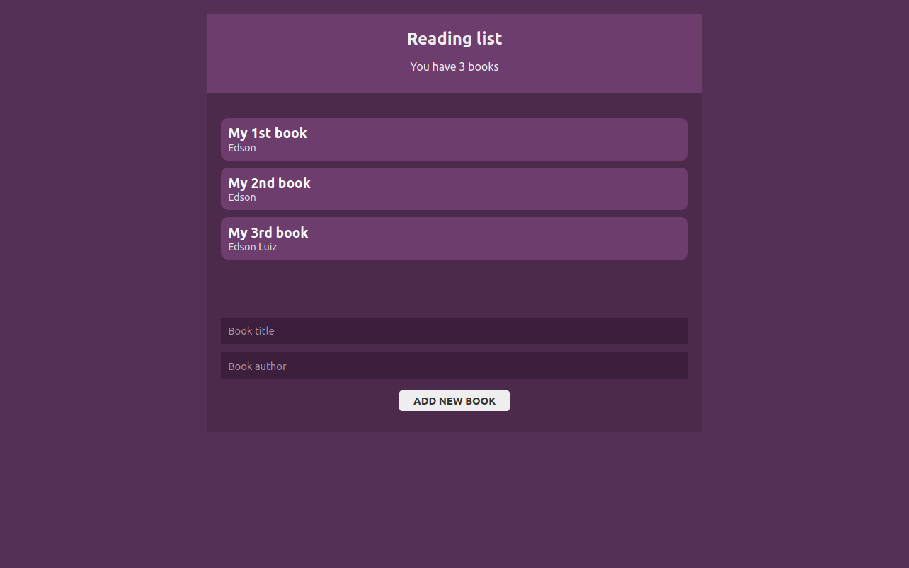

# [BookList](https://determined-ride-712758.netlify.app/)

  

## Objetivo

Praticar o uso de features do react através de um projeto prático.

## Projeto

Permitir o gerenciamento de livros para leitura.

## Tecnologias utilizadas

- React
  - CRA (Create React App)
- Styled Components
- Context API
- localStorage
- Hooks
  - useState
  - useReducer
  - useEffect
  - useContext

## Resultado

Você pode acessar o projeto através deste [LINK.](https://determined-ride-712758.netlify.app/)
